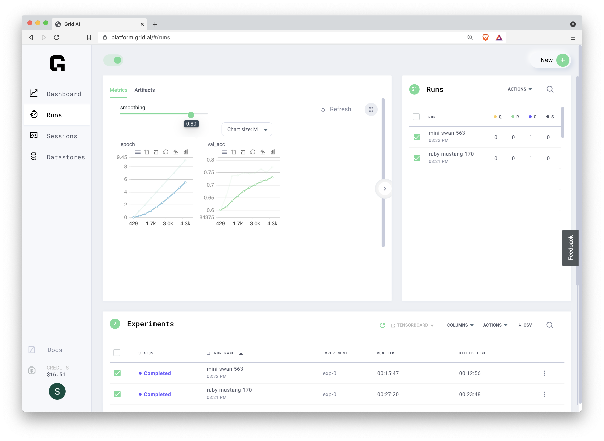

[Grid](https://www.grid.ai) can seamlessly train 100s of machine learning models on the cloud from your laptop, with zero code change.  

In this example, we will demonstrate running a model on laptop, then run the unmodified model on the cloud, then run hyperparameter sweeps in parallel that is only possible in cloud to **see the results 8x faster**, then finally leverage spot instance to **reduce cost of the run by 70%**. 


We will use familiar [MNIST](http://yann.lecun.com/exdb/mnist/) using [PyTorch Lightning](https://www.pytorchlightning.ai) framework.
To make the test more interesting, we will not use [PyTorch Lightning's Early Stop](https://medium.com/pytorch/pytorch-lightning-1-3-lightning-cli-pytorch-profiler-improved-early-stopping-6e0ffd8deb29).  Instead, we will [Optuna](https://optuna.org) for early stopping to show that Grid is agnostics to what is running.
, run it on laptop, then on train on Grid with zero code change.


- batchsize=[32,128]
- epochs=[5,10]
- pruning=[true,false]

``` bash
grid run --use_spot pytorch_lightning_simple.py --datadir grid:fashionmnist:7 --pruning="['true','false']"  --batchsize="[32,128]" --epochs="[5,10]"
```

## Local python environment setup and log into Grid

```bash
# create conda env
conda create --name gridai python=3.7
conda activate gridai
# install packages
pip install lightning-grid
pip install optuna
pip install pytorch_lightning
pip install torchvision
# login to grid
grid login --username <username> --key <grid api key>
```

## Run the model locally on laptop  

```bash
# retrieve the model
git clone https://github.com/robert-s-lee/grid-optuna
cd grid-optuna
mkdir data
# Run without Optuna pruning (takes a while)
python pytorch_lightning_simple.py --datadir ./data
# Run with Optuna pruning (takes a while)
python pytorch_lightning_simple.py --datadir ./data --pruning
```

## Prepare Grid for repeated training  

- setup datastore so that MNIST data is not downloaded on each Cloud VM  

```bash
grid datastore create --source data --name fashionmnist 
```

- setup `requirements.txt`  that will be setup on each Cloud VM

```bash
touch requirements.txt
grid sync-env
git add requirements.txt
git commit -m "requirements.txt synced with current environment"
```
        
## Run on Grid

The only change required are:
- python to grid run
- MNIST location from `data` to `grid:fashionmnist:7` indicating this 7 revision of fashionmnist datastore.
  
```bash
# Run without Optuna pruning (takes a while)
grid run pytorch_lightning_simple.py --datadir grid:fashionmnist:7
# Run with Optuna pruning (takes a while)
grid run pytorch_lightning_simple.py --datadir grid:fashionmnist:7 --pruning  
```

## Check progress on Grid from CLI

- The above commands will show below (abbreviated)
  
```bash
                Run submitted!
                `grid status` to list all runs
                `grid status mini-swan-563` to see all experiments for this run
```
- `grid status mini-swan-563` shows experiments running in parallel
  
```bash
━━━━━━━━━━━━━━━━━━━━┳━━━━━━━━━━━━━━━━━━━━━━━━━━━━━┳━━━━━━━━━┳━━━━━━━━━━━━━┳━━━━━━━━━━━━━━━━━━━━━━━━━━┳━━━━━━━━━┓
┃ Experiment         ┃                     Command ┃  Status ┃    Duration ┃                  datadir ┃ pruning ┃
┡━━━━━━━━━━━━━━━━━━━━╇━━━━━━━━━━━━━━━━━━━━━━━━━━━━━╇━━━━━━━━━╇━━━━━━━━━━━━━╇━━━━━━━━━━━━━━━━━━━━━━━━━━╇━━━━━━━━━┩
│ mini-swan-563-exp0 │ pytorch_lightning_simple.py │ pending │ 0d-00:03:36 │ /datastores/fashionmnist │    True │
└────────────────────┴─────────────────────────────┴─────────┴─────────────┴──────────────────────────┴─────────┘
```

- `grid logs mini-swan-563-exp0` shows logs from that experiment

```bash
grid logs mini-swan-563-exp0
```

## Check realtime viewing Tensorboard graphs on Grid



# How this example was built

## make location of training data command line argument 

```bash
curl -O https://raw.githubusercontent.com/optuna/optuna-examples/main/pytorch/pytorch_lightning_simple.py
chmod a+x pytorch_lightning_simple.py

diff pytorch_lightning_simple.py ~/github/optuna-examples/pytorch/pytorch_lightning_simple.py > patchfile.patch
129c129
<     datamodule = FashionMNISTDataModule(data_dir=args.datadir, batch_size=BATCHSIZE)
---
>     datamodule = FashionMNISTDataModule(data_dir=DIR, batch_size=BATCHSIZE)
155d154
<     parser.add_argument('--datadir', default=f'{os.getcwd()}', type=str)
```
