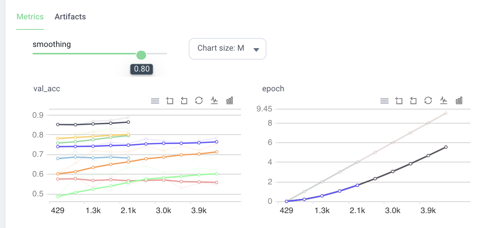
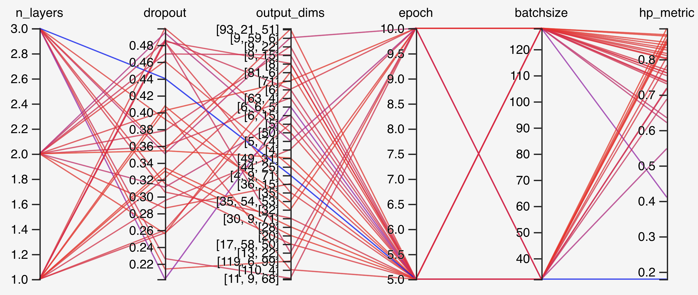

[Grid.ai](https://www.grid.ai) can seamlessly train 100s of machine learning models on the cloud from your laptop, with zero code change.
In this example, we will run a model on laptop, then run the unmodified model on the cloud.  On the cloud, we will run hyperparameter sweeps in parallel to **see the results 8x faster** and leverage spot instance to **reduce cost of the run by 70%**.  

# Overview

We will use familiar [MNIST](http://yann.lecun.com/exdb/mnist/).
Grid.ai is the creators of PyTorch Lightning.  Grid.ai is agnostics to Machine Learning frameworks and 3rd party tools.
The benefits of Grid.ai are available to other Machine Learning frameworks and tools.
To demonstrate this point, we will NOT use [PyTorch Lightning's Early Stop](https://medium.com/pytorch/pytorch-lightning-1-3-lightning-cli-pytorch-profiler-improved-early-stopping-6e0ffd8deb29).
Instead, we will use [Optuna](https://optuna.org) for early stopping.
We will track progress by viewing [PyTorch Lightning](https://www.pytorchlightning.ai)'s [Tensorboard](https://pytorch-lightning.readthedocs.io/en/stable/api/pytorch_lightning.loggers.tensorboard.html) in Grid.ai's [Tensorboard interface](https://docs.grid.ai/products/run-run-and-sweep-github-files/metrics-charts#tensorboard).

Grid.ai will launch experiments in parallel using [Grid Search](https://docs.grid.ai/products/run-run-and-sweep-github-files/sweep-syntax) strategy.  Grid.ai Hyperparamter sweep control `batchsize`, `epochs`, `pruning` -- whether Optuna is active or not. Optuna will control the the number of layers, hidden units in each layer and dropouts within each experiment.  The following combinations will result in 8 parallel experiments:

- batchsize=[32,128]
- epochs=[5,10]
- pruning=[0,1]

A single Grid.ai CLI command initiates the experiment.
 
``` bash
grid run --use_spot pytorch_lightning_simple.py --datadir grid:fashionmnist:7 --pruning="[0,1]"  --batchsize="[32,128]" --epochs="[5,10]"
```

# Step by Step Instruction

This instruction assumes access to a laptop with `bash` and `conda`.  For those with restricted local environment, please use SSH on [Grid.ai Session](https://docs.grid.ai/products/sessions#start-a-session).

## Local python environment setup

```bash
# create conda env
conda create --name gridai python=3.7
conda activate gridai
# install packages
pip install lightning-grid
pip install optuna
pip install pytorch_lightning
pip install torchvision
# login to grid
grid login --username <username> --key <grid api key>
```

## Run locally

```bash
# retrieve the model
git clone https://github.com/robert-s-lee/grid-optuna
cd grid-optuna
mkdir data
# Run without Optuna pruning (takes a while)
python pytorch_lightning_simple.py --datadir ./data
# Run with Optuna pruning (takes a while)
python pytorch_lightning_simple.py --datadir ./data --pruning 1
```

## Prepare Grid.ai Datastore 

Setup [Grid.a Datastore](https://docs.grid.ai/products/global-cli-configs/cli-api/grid-datastores) so that MNIST data is not downloaded on each run.  Note the **Version** number created.  Typically this will be **1**.

```bash
grid datastore create --source data --name fashionmnist 
grid datastore list
┏━━━━━━━━━━━━━━━┳━━━━━━━━━━━━━━━━━━━┳━━━━━━━━━┳━━━━━━━━━━┳━━━━━━━━━━━━━━━━━━┳━━━━━━━━━━━┓
┃ Credential Id ┃              Name ┃ Version ┃     Size ┃          Created ┃    Status ┃
┡━━━━━━━━━━━━━━━╇━━━━━━━━━━━━━━━━━━━╇━━━━━━━━━╇━━━━━━━━━━╇━━━━━━━━━━━━━━━━━━╇━━━━━━━━━━━┩
│ cc-qdfdk      │      fashionmnist │       1 │ 141.6 MB │ 2021-06-16 15:13 │ Succeeded │
└───────────────┴───────────────────┴─────────┴──────────┴──────────────────┴───────────┘
```
        
## Run on Grid
  
```bash
grid run --use_spot pytorch_lightning_simple.py --datadir grid:fashionmnist:7 --pruning="[0,1]"  --batchsize="[32,128]" --epochs="[5,10]"

```

The above commands will show below (abbreviated)
  
```bash
Run submitted!
`grid status` to list all runs
`grid status smart-dragon-43` to see all experiments for this run
```

`grid status smart-dragon-43` shows experiments running in parallel
  
```bash
% grid status smart-dragon-43
┏━━━━━━━━━━━━━━━━━━━━━━┳━━━━━━━━━━━━━━━━━━━━━━━━━━━━━┳━━━━━━━━━┳━━━━━━━━━━━━━┳━━━━━━━━━━━━━━━━━━━━━━━━━━┳━━━━━━━━━┳━━━━━━━━━━━┳━━━━━━━━┓
┃ Experiment           ┃                     Command ┃  Status ┃    Duration ┃                  datadir ┃ pruning ┃ batchsize ┃ epochs ┃
┡━━━━━━━━━━━━━━━━━━━━━━╇━━━━━━━━━━━━━━━━━━━━━━━━━━━━━╇━━━━━━━━━╇━━━━━━━━━━━━━╇━━━━━━━━━━━━━━━━━━━━━━━━━━╇━━━━━━━━━╇━━━━━━━━━━━╇━━━━━━━━┩
│ smart-dragon-43-exp7 │ pytorch_lightning_simple.py │ running │ 0d-00:07:24 │ /datastores/fashionmnist │       1 │        32 │     10 │
│ smart-dragon-43-exp6 │ pytorch_lightning_simple.py │ running │ 0d-00:07:27 │ /datastores/fashionmnist │       1 │        32 │      5 │
│ smart-dragon-43-exp5 │ pytorch_lightning_simple.py │ running │ 0d-00:07:14 │ /datastores/fashionmnist │       1 │       128 │      5 │
│ smart-dragon-43-exp4 │ pytorch_lightning_simple.py │ pending │ 0d-00:12:52 │ /datastores/fashionmnist │       0 │       128 │      5 │
│ smart-dragon-43-exp3 │ pytorch_lightning_simple.py │ running │ 0d-00:07:13 │ /datastores/fashionmnist │       0 │        32 │     10 │
│ smart-dragon-43-exp2 │ pytorch_lightning_simple.py │ running │ 0d-00:07:03 │ /datastores/fashionmnist │       0 │       128 │     10 │
│ smart-dragon-43-exp1 │ pytorch_lightning_simple.py │ running │ 0d-00:07:02 │ /datastores/fashionmnist │       1 │       128 │     10 │
│ smart-dragon-43-exp0 │ pytorch_lightning_simple.py │ pending │ 0d-00:12:52 │ /datastores/fashionmnist │       0 │        32 │      5 │
└──────────────────────┴─────────────────────────────┴─────────┴─────────────┴──────────────────────────┴─────────┴───────────┴────────┘
```

`grid logs smart-dragon-43-exp0` shows logs from that experiment

```bash
grid logs smart-dragon-43
```

## Use Grid.ai WebUI for Tensorboard graphs

Example Metric from Grid.ai WebUI



Example Metric from Tensorboard



# How this example was built

- Make hard coded variables passed via command line arguments
  
```bash
curl -O https://raw.githubusercontent.com/optuna/optuna-examples/main/pytorch/pytorch_lightning_simple.py
chmod a+x pytorch_lightning_simple.py

diff pytorch_lightning_simple.py ~/github/optuna-examples/pytorch/pytorch_lightning_simple.py > patchfile.patch
36c36
< BATCHSIZE = 128 # make this parameter
---
> BATCHSIZE = 128
38,39c38,39
< EPOCHS = 10 # make this parameter
< DIR = os.getcwd() # make this parameter
---
> EPOCHS = 10
> DIR = os.getcwd()
129c129
<     datamodule = FashionMNISTDataModule(data_dir=args.datadir, batch_size=args.batchsize)
---
>     datamodule = FashionMNISTDataModule(data_dir=DIR, batch_size=BATCHSIZE)
135c135
<         max_epochs=args.epochs,
---
>         max_epochs=EPOCHS,
139c139
<     hyperparameters = dict(n_layers=n_layers, dropout=dropout, output_dims=output_dims, epoch=args.epochs, batchsize=args.batchsize)
---
>     hyperparameters = dict(n_layers=n_layers, dropout=dropout, output_dims=output_dims)
151c151
<         default=0, type=int,
---
>         action="store_true",
155,157d154
<     parser.add_argument('--datadir', default=f'{os.getcwd()}', type=str)
<     parser.add_argument('--batchsize', default=BATCHSIZE, type=int)
<     parser.add_argument('--epochs', default=EPOCHS, type=int)
```

- `requirements.txt` creating using `grid sync-env`

```bash
touch requirements.txt
grid sync-env
git add requirements.txt
git commit -m "requirements.txt synced with current environment"
```
